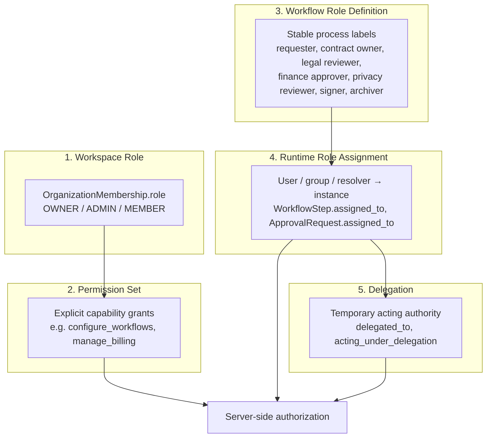

# PAR-ID-001 — Target role model

**Date:** 2026-07-22  
**Status:** Proposed target — requires **Accepted ADR-0014** before implementation  
**Authority:** CANONICAL_DOMAIN_MODEL §2.5, SECURITY_PRIVACY_ACCESS_AND_AUDIT

---

## Concept separation



---

## 1. Workspace Role

**Purpose:** Organization-level membership and administrative authority.

| Attribute | Target |
|---|---|
| **Canonical name** | Workspace Role |
| **Interim storage** | `OrganizationMembership.role` |
| **Values** | `OWNER`, `ADMIN`, `MEMBER` (unchanged until Accepted mapping) |
| **Scope** | Per `(organization, user)` — **must remain org-scoped** |
| **Grants** | Org administration, configuration surfaces, elevated object operations per Permission Set |
| **Does not grant** | Process responsibilities (legal reviewer, signer) by label alone |

**Rules:**
- Workspace Role labels do not imply workflow Role Definitions.
- SCIM/SAML map to Workspace Role only unless explicit future PDR authorizes more.

---

## 2. Permission Set

**Purpose:** Concrete platform permissions evaluated server-side.

| Attribute | Target |
|---|---|
| **Canonical name** | Permission Set |
| **Interim storage** | Implicit in `permissions.py` functions (no first-class model today) |
| **Examples** | `manage_organization`, `edit_any_contract`, `view_contract`, `decide_approval`, `configure_workflow` |
| **Scope** | Derived from Workspace Role + Runtime Assignment + object context |
| **Evaluation** | **Always server-side** — never from nav visibility or UI labels |

**Rules:**
- UI visibility is not authorization.
- Permission Sets may be composed; no hidden escalation via role label collision.
- API token scopes remain a separate machine Permission Set.

**Target implementation (post-Acceptance):**
- Governed mapping registry: `(Workspace Role, context) → Permission Set`
- Optional explicit `PermissionSet` model or documented function matrix — decision in ADR-0014 acceptance vote.

---

## 3. Workflow Role Definition

**Purpose:** Stable process responsibility in a workflow or approval chain.

| Attribute | Target |
|---|---|
| **Canonical name** | Workflow Role Definition (maps to CANONICAL_DOMAIN_MODEL §2.5) |
| **Interim storage** | `UserProfile.role` char on templates/rules; functional codes on DPA risk items |
| **Canonical examples** | requester, contract owner, legal reviewer, finance approver, privacy reviewer, signer, archiver |
| **Scope** | **Org-scoped definition** (target) — not user-global |
| **Phase** | Configuration-time label on templates, rules, routes |

**Rules:**
- Role Definition labels **do not grant hidden permissions**.
- `ApprovalRoute.role_label` becomes display-only or links to governed Definition ID.
- `ADMIN` process label must be renamed or aliased to disambiguate from Workspace ADMIN (e.g. `operations_administrator`).

**Mapping from interim enums:**

| Interim `UserProfile.Role` | Target Workflow Role Definition | Notes |
|---|---|---|
| `PARTNER` | senior_approver / partner_reviewer | Org-configurable display |
| `SENIOR_ASSOCIATE` | senior_reviewer | |
| `ASSOCIATE` | legal_reviewer | Default pilot associate |
| `PARALEGAL` | paralegal_reviewer | |
| `LEGAL_ASSISTANT` | legal_assistant | |
| `ADMIN` | **ambiguous — requires explicit mapping** | **Not** workspace admin |
| `CLIENT` | external_participant | Portal scope |

Unknown historical values remain explicit in mapping table — never guessed.

---

## 4. Runtime Role Assignment

**Purpose:** The user, group, or governed resolver assigned to a Workflow Instance or approval at execution time.

| Attribute | Target |
|---|---|
| **Canonical name** | Runtime Role Assignment |
| **Interim storage** | `WorkflowStep.assigned_to`, `ApprovalRequest.assigned_to`, `Contract.owner`, `DPAReviewPack.reviewer`, `SignatureRequest.signer_email` |
| **Scope** | Per object, **tenant-scoped** |
| **Phase** | Runtime — materialized at launch or rule evaluation |
| **Attribution** | Immutable record of who was assigned at decision time |

**Rules:**
- Configuration Role Definitions resolve to Runtime Assignments — they are not interchangeable.
- Resolver order: `specific_assignee` / `specific_approver` → governed resolver → fail safe (no assignee).
- Cross-tenant resolution **prohibited** — return null / 404.
- Role changes after assignment do not rewrite historical decisions or audit rows.
- Unresolved assignments fail safely (no default-to-admin escalation).

**Resolver contract (target):**

```
resolve_runtime_assignment(
  role_definition_id,
  contract,
  *,
  fail_closed=True,
) → User | None
```

---

## 5. Delegation

**Purpose:** Temporary authority exercised on behalf of another assignment.

| Attribute | Target |
|---|---|
| **Canonical name** | Delegation |
| **Interim storage** | `ApprovalRequest.delegated_to`, `ApprovalRequirement.delegated_*`, `ApprovalDecision.acting_under_delegation` |
| **Scope** | Per approval object, tenant-scoped |
| **Phase** | Runtime |

**Rules:**
- Original assignee preserved; delegate is acting authority only.
- Audit records both original and acting principal.
- Delegation ≠ reassignment (admin transfer clears delegation).
- Delegation cannot widen beyond assignee's decision scope.
- Expiry (`delegation_ends_at`) enforced server-side.

---

## System roles vs human roles

| Type | Examples | Rules |
|---|---|---|
| **Human** | Workspace member, assignee, delegate, signer | Full authz path |
| **System** | Background job processor, migration backfill, scheduled lifecycle | Explicit service principal; no human role inheritance |
| **Machine** | API token scopes | Separate Permission Set; org-scoped |

---

## Invariants (required)

1. Role labels do not themselves grant hidden permissions.
2. UI visibility is not authorization.
3. All authorization remains server-side.
4. Configuration roles are separate from runtime assignees.
5. Runtime assignments are attributable and tenant-scoped.
6. Delegation preserves original and acting authority.
7. Historical role assignments remain auditable.
8. Role changes do not rewrite historical decisions.
9. Cross-tenant role resolution is prohibited.
10. System roles and human roles are explicit.
11. Unresolved assignments fail safely.

---

## Relationship to interim code

| Interim | Target | Transition |
|---|---|---|
| `OrganizationMembership.role` | Workspace Role | Keep; add mapping registry |
| `UserProfile.role` | Workflow Role Definition (transitional) | Org-scope + rename ambiguous values |
| `permissions.py` helpers | Permission Set evaluation | Document matrix; optional model |
| `assigned_to` FKs | Runtime Role Assignment | Add provenance fields if needed |
| `delegated_to` | Delegation | Already aligned post ADR-0013 |

---

## Out of scope (target model)

- SCIM profile role sync (separate programme)
- Full RBAC productization
- Client portal role overhaul
- Django Group adoption (optional future)
