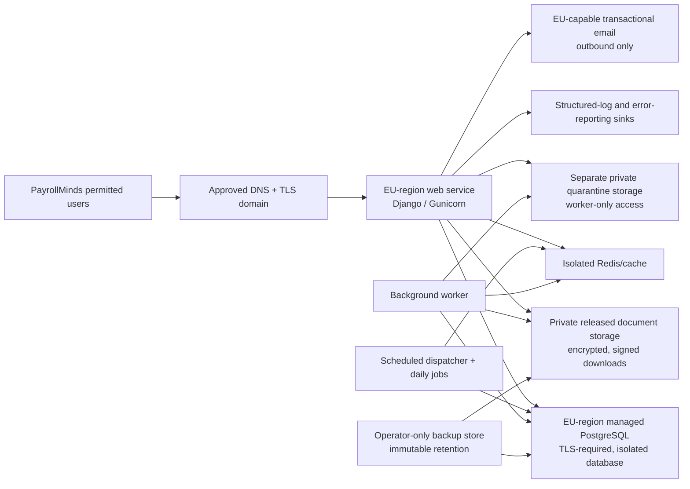

# PayrollMinds proposed production infrastructure plan

**Status:** Proposed — no resources provisioned, public endpoint activated, or
customer data accepted.
**Decision dependency:** Proposed ADR-0017.
**Blocker source:** `PAYROLLMINDS_LAUNCH_READINESS.md` PM-OPS-01/02,
PM-SEC-04/05, PM-PRIV-01, and PM-QLT-01.

## Scope boundary

This plan prepares the existing Django/PostgreSQL/S3-compatible architecture
for a bounded pilot. It does not approve a provider contract, data residency,
customer commitment, real-data processing, public DNS, or production launch.
AI and forwarded-email ingestion stay disabled. The existing free demo
`render.yaml` remains demo-only and is not a production manifest.

## Proposed isolated topology

All production components must use the selected provider's Frankfurt/EU region
where available. The infrastructure operator must retain the provider-region,
backup-location, subprocessors, and transfer evidence before Go. A region
label in configuration is not sufficient evidence of residency.

## Environment separation

| Environment | Data | Identity and resources | Exposure |
|---|---|---|---|
| Development | local synthetic only | local SQLite/filesystem; no production secrets | local only |
| Pre-production | synthetic or specifically approved non-production data | separate project/account, PostgreSQL, Redis, storage, secrets, email sandbox, and domain | operator/reviewer-only |
| Production pilot | only approved pilot data | separate project/account, PostgreSQL, Redis, buckets, secret namespace, service identities, domain, and alert route | closed until release gate opens it |

No database, bucket, Redis endpoint, SMTP credential, scanner credential,
cookie-signing key, or administrator identity is shared across these
environments. Production backups are not restored into development.

## Controls to configure and evidence

| Area | Required control | Evidence before Go |
|---|---|---|
| Domain and TLS | approved domain; managed TLS; HTTPS-only; exact `ALLOWED_HOSTS` and `CSRF_TRUSTED_ORIGINS`; HSTS after domain verification | certificate/issuer, HTTPS response, configuration review |
| Database | dedicated managed PostgreSQL; `DB_SSL_REQUIRE=true`; least-privilege app role; separate backup role | engine/SSL probe, role grant review, encrypted backup record |
| Released storage | private S3-compatible bucket, block-public-access, encryption, versioning, short signed URLs | IAM/policy export, encryption/versioning setting, authorized download probe |
| Quarantine | separate private encrypted bucket/prefix and worker-only identity; no download route | IAM/policy export and denied web-access probe |
| Secrets | provider secret injection only; no values in Git/logs/tickets; rotation log | redacted inventory, rotation/restart rehearsal |
| Jobs | one worker plus dispatch/daily scheduler; job heartbeat and dead-letter review | `ScheduledJobRun`, health JSON, alert receipt |
| Email | transactional outbound provider only; verified sender and approved support recipient | sandbox delivery result, bounce/complaint policy |
| Logging/errors | structured request logs and a selected error-reporting sink with access control and retention | redacted test exception/event and alert receipt |

See the companion environment inventory, deployment/rollback, operations,
backup/restore, and offboarding runbooks in this directory.
